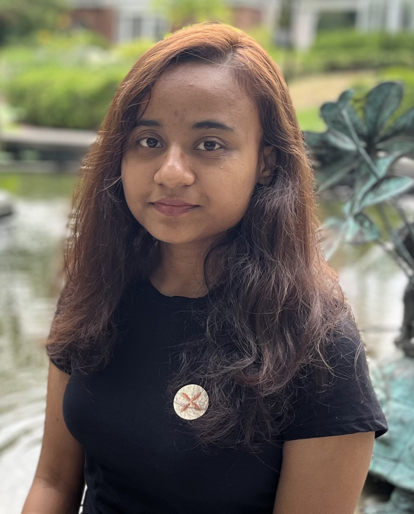

    
    

        <ul class="no-style-ul overview-ul" style="margin-bottom: 8px;">
            <li>
                <h2 style="margin:0; padding: 0;">Shristi Shrestha</h2>
            </li>
            <li>
                
Phd Student

            </li>
            <li>
                
Division of Computer Science and Engineering

            </li>
            <li>
                
Louisiana State University, Baton Rouge, LA

            </li>
        </ul>
        <ul class="no-style-ul" style="margin-bottom: 8px;">
            <li class="lead-li"> 
                Email: <a href="mailto:sshre35@lsu.edu">sshre35@lsu.edu
                </a>
            </li>
        </ul>
        <!-- Google Scholar -->
        

            

                    <a href="https://scholar.google.com/citations?user=NHIjzpEAAAAJ" style="text-decoration: none;"
                    target="_blank">
                        <svg class="svg-inline--fa fa-linkedin-in" aria-hidden="true" focusable="false" data-prefix="fab" data-icon="linkedin-in" role="img" xmlns="http://www.w3.org/2000/svg" viewBox="0 0 512 512"><path fill="currentColor" d="M390.9 298.5c0 0 0 .1 .1 .1c9.2 19.4 14.4 41.1 14.4 64C405.3 445.1 338.5 512 256 512s-149.3-66.9-149.3-149.3c0-22.9 5.2-44.6 14.4-64h0c1.7-3.6 3.6-7.2 5.6-10.7c4.4-7.6 9.4-14.7 15-21.3c27.4-32.6 68.5-53.3 114.4-53.3c33.6 0 64.6 11.1 89.6 29.9c9.1 6.9 17.4 14.7 24.8 23.5c5.6 6.6 10.6 13.8 15 21.3c2 3.4 3.8 7 5.5 10.5zm26.4-18.8c-30.1-58.4-91-98.4-161.3-98.4s-131.2 40-161.3 98.4L0 202.7 256 0 512 202.7l-94.7 77.1z"/></svg>
                    </a>
            

            <!-- Linkedin -->
            

                <a href="https://www.linkedin.com/in/shristi-shrestha-a77264164/" 
                style="text-decoration: none;" target="_blank">
                    <svg class="svg-inline--fa fa-linkedin-in" aria-hidden="true" focusable="false" data-prefix="fab" data-icon="linkedin-in" role="img" xmlns="http://www.w3.org/2000/svg" viewBox="0 0 448 512" data-fa-i2svg=""><path fill="currentColor" d="M100.28 448H7.4V148.9h92.88zM53.79 108.1C24.09 108.1 0 83.5 0 53.8a53.79 53.79 0 0 1 107.58 0c0 29.7-24.1 54.3-53.79 54.3zM447.9 448h-92.68V302.4c0-34.7-.7-79.2-48.29-79.2-48.29 0-55.69 37.7-55.69 76.7V448h-92.78V148.9h89.08v40.8h1.3c12.4-23.5 42.69-48.3 87.88-48.3 94 0 111.28 61.9 111.28 142.3V448z"></path></svg>
                </a>
            

            <!-- Twitter -->
            

                <a href="https://twitter.com/Shrististha7" style="text-decoration: none;"
                target="_blank">
                    <svg class="svg-inline--fa fa-twitter" aria-hidden="true" focusable="false" data-prefix="fab" data-icon="twitter" role="img" xmlns="http://www.w3.org/2000/svg" viewBox="0 0 512 512" data-fa-i2svg=""><path fill="currentColor" d="M459.37 151.716c.325 4.548.325 9.097.325 13.645 0 138.72-105.583 298.558-298.558 298.558-59.452 0-114.68-17.219-161.137-47.106 8.447.974 16.568 1.299 25.34 1.299 49.055 0 94.213-16.568 130.274-44.832-46.132-.975-84.792-31.188-98.112-72.772 6.498.974 12.995 1.624 19.818 1.624 9.421 0 18.843-1.3 27.614-3.573-48.081-9.747-84.143-51.98-84.143-102.985v-1.299c13.969 7.797 30.214 12.67 47.431 13.319-28.264-18.843-46.781-51.005-46.781-87.391 0-19.492 5.197-37.36 14.294-52.954 51.655 63.675 129.3 105.258 216.365 109.807-1.624-7.797-2.599-15.918-2.599-24.04 0-57.828 46.782-104.934 104.934-104.934 30.213 0 57.502 12.67 76.67 33.137 23.715-4.548 46.456-13.32 66.599-25.34-7.798 24.366-24.366 44.833-46.132 57.827 21.117-2.273 41.584-8.122 60.426-16.243-14.292 20.791-32.161 39.308-52.628 54.253z"></path></svg>
                </a>
            

            <!-- GitHub -->
            

                <a href="https://github.com/ShristiShrestha" style="text-decoration: none;"
                target="_blank">
                    <svg class="svg-inline--fa fa-github" aria-hidden="true" focusable="false" data-prefix="fab" data-icon="github" role="img" xmlns="http://www.w3.org/2000/svg" viewBox="0 0 496 512" data-fa-i2svg=""><path fill="currentColor" d="M165.9 397.4c0 2-2.3 3.6-5.2 3.6-3.3.3-5.6-1.3-5.6-3.6 0-2 2.3-3.6 5.2-3.6 3-.3 5.6 1.3 5.6 3.6zm-31.1-4.5c-.7 2 1.3 4.3 4.3 4.9 2.6 1 5.6 0 6.2-2s-1.3-4.3-4.3-5.2c-2.6-.7-5.5.3-6.2 2.3zm44.2-1.7c-2.9.7-4.9 2.6-4.6 4.9.3 2 2.9 3.3 5.9 2.6 2.9-.7 4.9-2.6 4.6-4.6-.3-1.9-3-3.2-5.9-2.9zM244.8 8C106.1 8 0 113.3 0 252c0 110.9 69.8 205.8 169.5 239.2 12.8 2.3 17.3-5.6 17.3-12.1 0-6.2-.3-40.4-.3-61.4 0 0-70 15-84.7-29.8 0 0-11.4-29.1-27.8-36.6 0 0-22.9-15.7 1.6-15.4 0 0 24.9 2 38.6 25.8 21.9 38.6 58.6 27.5 72.9 20.9 2.3-16 8.8-27.1 16-33.7-55.9-6.2-112.3-14.3-112.3-110.5 0-27.5 7.6-41.3 23.6-58.9-2.6-6.5-11.1-33.3 2.6-67.9 20.9-6.5 69 27 69 27 20-5.6 41.5-8.5 62.8-8.5s42.8 2.9 62.8 8.5c0 0 48.1-33.6 69-27 13.7 34.7 5.2 61.4 2.6 67.9 16 17.7 25.8 31.5 25.8 58.9 0 96.5-58.9 104.2-114.8 110.5 9.2 7.9 17 22.9 17 46.4 0 33.7-.3 75.4-.3 83.6 0 6.5 4.6 14.4 17.3 12.1C428.2 457.8 496 362.9 496 252 496 113.3 383.5 8 244.8 8zM97.2 352.9c-1.3 1-1 3.3.7 5.2 1.6 1.6 3.9 2.3 5.2 1 1.3-1 1-3.3-.7-5.2-1.6-1.6-3.9-2.3-5.2-1zm-10.8-8.1c-.7 1.3.3 2.9 2.3 3.9 1.6 1 3.6.7 4.3-.7.7-1.3-.3-2.9-2.3-3.9-2-.6-3.6-.3-4.3.7zm32.4 35.6c-1.6 1.3-1 4.3 1.3 6.2 2.3 2.3 5.2 2.6 6.5 1 1.3-1.3.7-4.3-1.3-6.2-2.2-2.3-5.2-2.6-6.5-1zm-11.4-14.7c-1.6 1-1.6 3.6 0 5.9 1.6 2.3 4.3 3.3 5.6 2.3 1.6-1.3 1.6-3.9 0-6.2-1.4-2.3-4-3.3-5.6-2z"></path></svg>
                </a>
            

        

    

### About me
I am a PhD candidate in Computer Science, conducting research on mobile apps and app stores under the mentorship of <a href="https://csc.lsu.edu/~mahmoud/" target="_blank">Dr. Anas Mahmoud</a>. My research focuses on user feedback analysis by applying natural language processing (NLP), qualitative and statistical methods. I aim to aid users in their app-related decisions such as discovering, utilizing, and recommending apps.

---

### Education
<ul class="no-style-ul overview-ul education-ul" style="margin-bottom: 8px;">
    <li>
        

            
PhD in Computer Science

             
2022-present

        

        

            
Louisiana State University, USA

        

    </li>
    <li>
        

            
Bachelor in Computer Engineering

             
2015-2019

        

        

            
Tribhuwan University, Nepal

        

    </li>
</ul>

---

### Publications
<ul class="no-style-ul overview-ul education-ul" style="margin-bottom: 8px;">
    <li>
        

            <a class="h-start-flex paper-link" href="https://dl.acm.org/doi/10.1145/3647632.3647986" target="_blank">
                
Generating Rate Features for Mobile Applications
                

                <!-- <svg style="width:12px; margin-left:4px; color:#39c;" xmlns="http://www.w3.org/2000/svg" viewBox="0 0 640 512"><path fill="currentColor" d="M579.8 267.7c56.5-56.5 56.5-148 0-204.5c-50-50-128.8-56.5-186.3-15.4l-1.6 1.1c-14.4 10.3-17.7 30.3-7.4 44.6s30.3 17.7 44.6 7.4l1.6-1.1c32.1-22.9 76-19.3 103.8 8.6c31.5 31.5 31.5 82.5 0 114L422.3 334.8c-31.5 31.5-82.5 31.5-114 0c-27.9-27.9-31.5-71.8-8.6-103.8l1.1-1.6c10.3-14.4 6.9-34.4-7.4-44.6s-34.4-6.9-44.6 7.4l-1.1 1.6C206.5 251.2 213 330 263 380c56.5 56.5 148 56.5 204.5 0L579.8 267.7zM60.2 244.3c-56.5 56.5-56.5 148 0 204.5c50 50 128.8 56.5 186.3 15.4l1.6-1.1c14.4-10.3 17.7-30.3 7.4-44.6s-30.3-17.7-44.6-7.4l-1.6 1.1c-32.1 22.9-76 19.3-103.8-8.6C74 372 74 321 105.5 289.5L217.7 177.2c31.5-31.5 82.5-31.5 114 0c27.9 27.9 31.5 71.8 8.6 103.9l-1.1 1.6c-10.3 14.4-6.9 34.4 7.4 44.6s34.4 6.9 44.6-7.4l1.1-1.6C433.5 260.8 427 182 377 132c-56.5-56.5-148-56.5-204.5 0L60.2 244.3z"/></svg> -->
             </a>
        

        

            

            S. Shrestha and A. Mahmoud, International Conference on Mobile Software Engineering and Systems (MobileSoft), 2024.

        

    </li>
</ul>

---

### Teaching
<ul class="no-style-ul overview-ul" style="margin-bottom: 8px;">
    <li>
        

            
Graduate Teaching Assistant, LSU

            
Fall 2023

        

        

            
Introduction to Java

        

    </li>
</ul>

